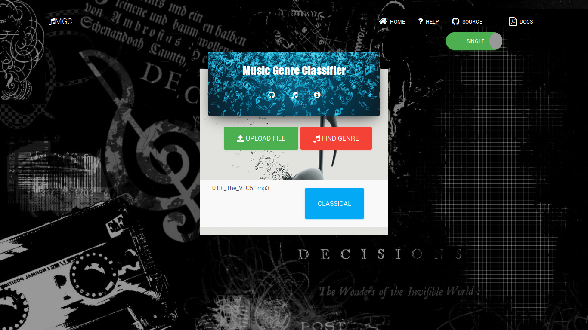

[Demo](https://github.com/indrajithi/mgc-django).

Introduction
============

This is a small implementation of a Poly Kernel SVM to Classify music in to genres.

Features
========

* Classify Music in to Genres
* Supports Audio and Video files in all major formats.
* Select multiple files

Requirements
============

* Django (1.11)
* Numpy (1.12.1)
* Scikit-Learn (0.18.1)
* Scipy (0.19.0)

Installation
============
* `git clone https://github.com/indrajithi/mgc-django.git`
* `pip install -r requirements.txt` 
* `python manage.py migrate`
* `python manage.py runserver`
* go to `localhost:8000` and upload some files

License
=======
MIT, as the original project. See LICENSE.txt

