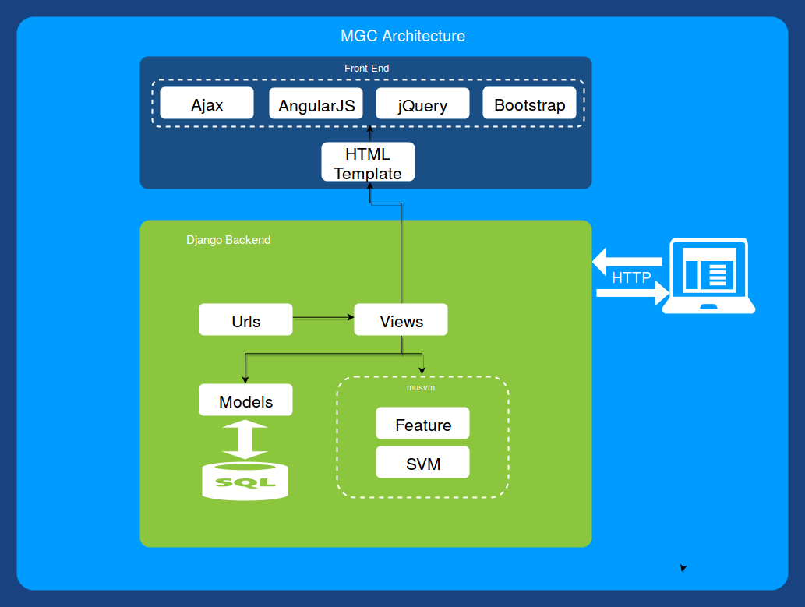
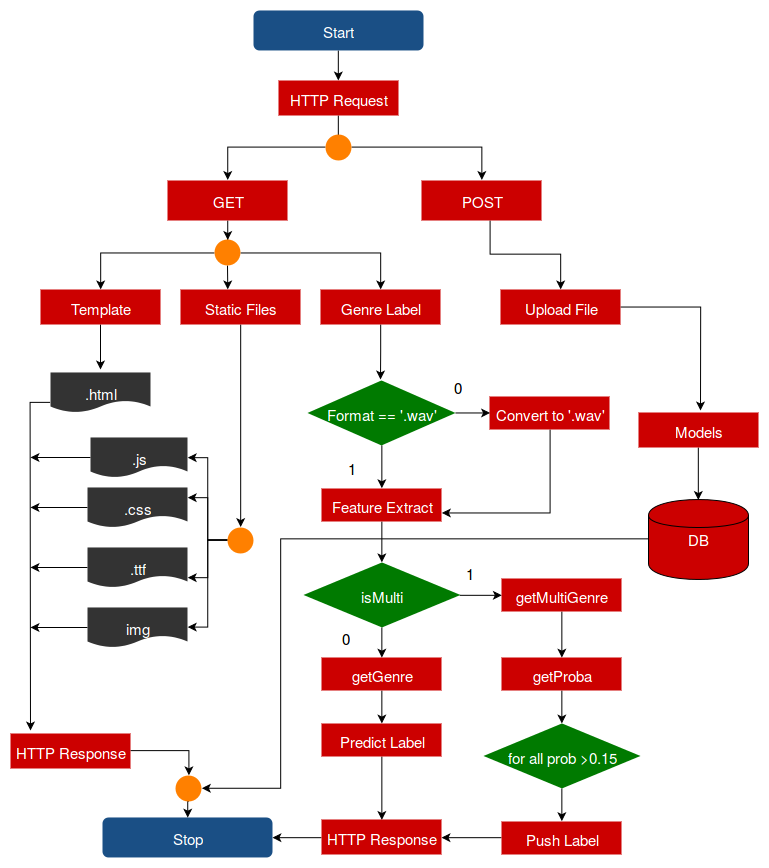

Music Genre Classifier
======================


### Table of Contents

- [Introduction](#introduction)
- [Requirements](#requirements) 
- [Installation](#installation)
- [Music Genre Classifier App](#music-genre-classifier-app)
- [Architecture](#architecture)
- [Flow Chart](#flow-chart)
- [Prototype](#prototype)
    - [Feature Extraction](#feature-extraction)
    - [Principal Component Analysis.](#principal-component-analysis)
    - [Dimensionality reduction](#dimensionality-reduction)
    - [Classification](#classification)
        - [K-nearest neighbors (KNN)](#k-nearest-neighbors-knn)
        - [Logistic Regression](#logistic-regression)
- [Python package mysvm](#python-package-mysvm)
    - [*feature*](#feature)
    - [*svm*](#svm)
    - [*acc*](#acc)
- [Results](#results)
- [Conclusion](#conclusion)
- [License](#license)


Introduction
------------

Music is categorized into subjective categories called genres. With the growth of the internet and multimedia systems applications that deal with the musical databases gained importance and demand for Music Information Retrieval (MIR) applications increased. Musical genres have no strict definitions and boundaries as they arise through a complex interaction between the public, marketing, historical, and cultural factors. This is Web Application that Classify Music in to genres. 

Requirements
------------

* Django (1.11)
* Numpy (1.12.1)
* Scikit-Learn (0.18.1)
* Scipy (0.19.0)
* Python-Speech-Features (0.5)
* Pydub (0.18.0)

Installation
-------------
* `git clone https://github.com/indrajithi/mgc-django.git`
* `pip install -r requirements.txt` 
* `python manage.py migrate`
* `python manage.py runserver`
* *App will run on* `localhost:8000`

## Music Genre Classifier App
Our web application is written in Python using Django framework. It uses a trained `Poly Kernel SVM` for finding the genre. Every HTTP request is first gone to the url dispatcher `urls.py` which will contain a view present in `views.py`. We can write rules in `views.py` to handle each HTTP request on that url.
    We have written views for HTTP POST and GET requests to upload music and find genre. There need to be models `(models.py)` for files that we store in the database. The file is automatically deleted once we find the genre. 
    Python objects can be saved in to the disk by using a module `Joblib` from `sklearn.externals`: `joblib.dump (object, filename)`. Our trained classifier is saved in to the disk and loaded by `joblib.load(filename)`. Since our training dataset is small, our classifier object does not need to be compressed. Our web application uses the package `mysvm` which we developed to extract features and to find the genre label.
    
Architecture
------------


Flow Chart
----------


The browser will send HTTP request as GET or POST from our Web App. GET request can be for loading templates which is an html file or for a static file, which includes front end JavaScript files (js), stylesheets (css), true type fonts(ttf) and image files. User upload the file by a HTTP POST. Our front end javascript will convert the given file as **BLOB (binary large objects)** files of size 1MB before POST. After a successful POST, user can send a GET request for finding the genre label. 

We have developed a python package called `mysvm` for extracting features and classifying music. This package is added to our Web App. On receiving a GET request for genre label, we convert the file to `.wav` if it is in other format. Then the features are extracted from the audio file using `mysvm.feature.extract (filename)`. Genre labels can be found by `mysvm.svm.getGenre(filename)` function call. If multi option is selected by the user then `mysvm.svm.getMultiGenre(filename)` function is called. This will get all the probabilities of a genres which the given music belongs to. If the probability is greater than 0.15, we will push the label into the stack of maximum size 3. The labels are sent as JSON data in the response. If single genre label is selected the label which is having highest probability is sent in response.

[Prototype](https://github.com/indrajithi/music-genre-classification-matlab)
-----------

We need to find the best classification algorithm that can be used in our Web App. Matlab is ideal to implement machine learning algorithms in minimum lines of code. Before making the Web App in python we made a prototype in Matlab. 

### Feature Extraction                                            

We chose to extract MFCC from the audio files as the feature. For finding MFCC in Matlab, we have used HTK MFCC MATLAB toolkit. The output will be a matrix of 13*n dimensional vector. Where n depends on the total duration of the audio. 13*(100*sec).  
    While feature extraction we were getting ‘nan’(not a number) and infinity in the output. This is usually caused be a division by zero or a very small number closed to 0 resulting in infinity/nan in the output. This could be a regular result or some algorithm or implementation error in the MFCC toolkit. To overcome this situation, we have set nan or infinity entries in the feature array to 0. 
    
### Principal Component Analysis.

Principal component analysis (PCA) is a statistical procedure that uses an orthogonal transformation to convert a set of observations of possibly correlated variables into a set of values of linearly uncorrelated variables called principal components (or sometimes, principal modes of variation) [7]. After doing a PCA on the data we got 90% variance and should reduce the feature dimension. 

 ```matlab
[input2, eigvec, eigvalue] = pca (ds. input);
cumvar = cumsum(eigvalue); //cumulative sum n(n+1)/2
cumvarpercent = cumvar/cumvar(end)*100;
```
### Dimensionality reduction
Various researchers take statistics such as mean variance IQR, etc., to reduce the feature dimension. Some researchers model it using multivariate regression and some fit it to a Gaussian mixture model. Here we are taking the mean and upper diagonal variance of 13*n MFCC coefficients. The result is a feature vector of size 104.
 ```matlab
 %Reducing Feature Dimeansion
 mf = mean(mm,2); %row mean
 cf = cov(mm'); % covariance
 ff = mf;
    for i=0:(size(mm,1)-1)
     ff = [ff;diag(cf,i)]; %use diagonals 
    end
 t(:,end+1) = ff(:,1);
 ```
### Classification
#### K-nearest neighbors (KNN)
Principle is that the data instance of the same class should be closer in the feature space.
For a given data point x of unknown class, we can compute the distance between x and all
the data points in the training data and assign the class determined by k nearest points of x.

```
Suppose we are given training dataset of n points.
{(x1,y1),(x2,y2)…(xn,yn)}
    Where (xi,yi) represents data pair i.
xi- feature vector
yi- target class
```
For a new data point x the most likely class is determined by finding the distance from all training data points (Euclidian distance).  The output class will be the class which k nearest neighbors belongs to. K is a predefined integer (k=1, k=2, k=3.) 
#### Logistic Regression

Logistic Regression is one of the widely used classification algorithm. This algorithm is used in medical as well as business fields for analytics and classification. This model has the hypothesis function  `0 ≤h  (x) ≤ 1.` Where  `hθ(x) = 11 + e-θTx  `called as Sigmoid or Logistic Function. For binary class classification` y ∈{0, 1}`. The output of this classifier will be a probability of the given input belonging to class 1. If` hθ(x) `outputs 0.7 it means that the given input has 70% chance of belonging to class 1.  Since we have 10 genre classes ` y ∈{0, 1 .. 9} `we used one-vs-all method for classification. 

Python package *mysvm*
--------------------
We developed a python package called `mysvm` which contains three modules: *features, svm, acc*. These are used by the web application in feature extraction and finding genre. This package also contains many other functions to do complicated feature extraction and classification.
```
├── acc.py
├── data
│   ├── classifier_10class.pkl
│   ├── classifier_10class_prob.pkl
│   ├── cmpr.pkl
│   └── Xall.npy
├── feature.py
├── __init__.py
├── svm.py
```
### *feature* 
This module is used to extract MFCC features from a given file. It contains the following functions.
* ***extract (file):*** 
Extract features from a given file. Files in other formats are converted to .wav format. Returns numpy array.
* ***extract_all (audio_dir):*** 
Extracts features from all files in a directory. 
* ***extract_ratio (train_ratio, test_ratio, audio_dir) :*** 
Extract features from all files in a directory in a ratio. Returns two numpy arrays.
* ***geny(n):*** 
Generates `Y` values for `n` classes. Returns numpy array.
* ***gen_suby(sub, n):***
Generates `Y` values for a subset of classes. Returns numpy array.
* ***gen_labels( ):***
Returns a list of all genre labels.
* ***flattern( x) :***
Flatterns a numpy array.
 
### *svm* 
A Support Vector Machine (SVM) is a discriminative classifier formally defined by a separating hyperplane. In other words, given labeled training data (supervised learning), the algorithm outputs an optimal hyperplane which categorizes new examples. This module contains various functions for classification using support vector machines.
* ***poly(X,Y):*** 
Trains a poly kernel SVM by fitting X, Y dataset. Returns a trained poly kernel SVM classifier.
* ***fit ( training_percentage, fold):*** 
Randomly choose songs from the dataset, and train the classifier. Accepts parameter: `train_percentage, fold`; Returns trained classifier.
* ***getprob (filename):***
Find the probabilities for a song belongs to each genre. Returns a dictionary mapping genre names to probability and a list of top 3 genres which is having probability of more than 0.15. 
* ***random_cross_validation (train_percentage,fold):***
Randomly cross validate with training percentage and fold. Accepts parameter: `train_percentage, fold`;
* ***findsubclass (class_count):***
Returns all possible ways we can combine the classes. Accepts an integer as class count. Returns numpy array of all possible combination.
* ***gen_sub_data (class_l):***
Generate a subset of the dataset for the given list of classes. Returns numpy array.
* ***fitsvm (Xall, Yall, class_l, train_percentage, fold):***
Fits a poly kernel svm and returns the accuracy. Accepts parameter: `train_percentage; fold`;  Returns: classifier, Accuracy.

* ***best_combinations (class_l, train_percentage, fold):***
Finds all possible combination of classes and the accuracy for the given number of classes Accepts: Training percentage, and number of folds Returns: A List of best combination possible for given the class count.

* ***getgenre (filename):***
Accepts a filename and returns a genre label for a given file.

* ***getgenreMulti (filename):***
Accepts a filename and returns top three genre labels based on the probability. 

### *acc*
 Module for finding the accuracy.
* ***get ( res, test ) :***  
Compares two arrays and returns the accuracy of their match.

Results
=======

| Classifier | Training Accuracy | Testing Accuracy |
|:---------: | :---------------: | :--------------: |
| K-Nearest Neighbors        |                   | 53%              |
| Logistic Regression|  75.778% | 54% |
| SVM Linear Kernel | 99% | 52% |
| SVM RBF Kernel | 99% | 12% |
| **SVM Poly Kernel** | **99%** | **64%** |

**6 genre classes we are getting an accuracy of 85%**

## Conclusion

We have tried various machine learning algorithms for this project. Our aim is to get maximum accuracy. We have found from our research that we can a get maximum accuracy of `65%` by using `poly kernel SVM` for 10 genre classes. We have also tried to find the best combination of genre classes which will result in maximum accuracy. If we choose 6 genre classes we were able to get an accuracy of `85%`. We chose these labels for the Web Application [classical, hip-hop, jazz, metal, pop and rock]
For some songs we can say that it has feature of multiple genres. So we have also tried to get multiple label outputs based on the probability.

